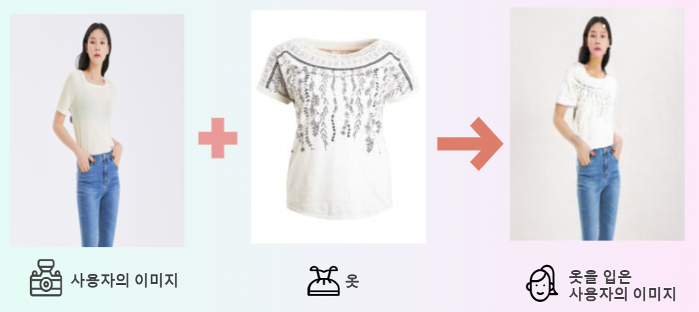
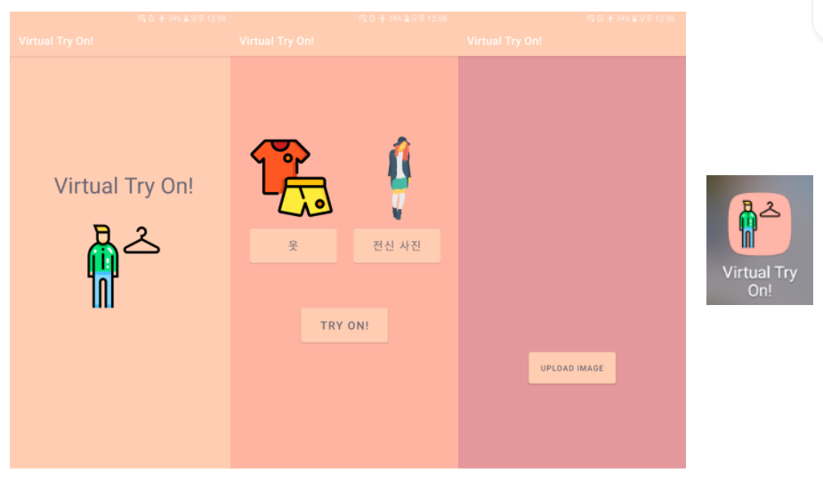
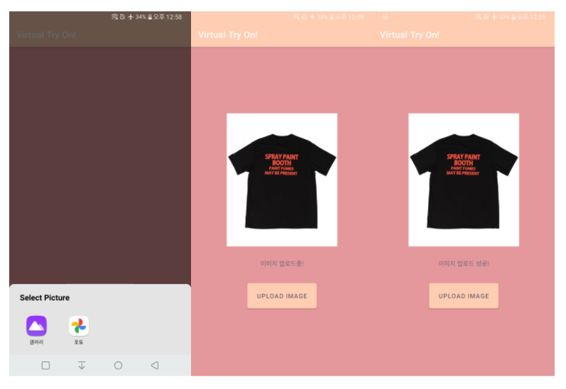
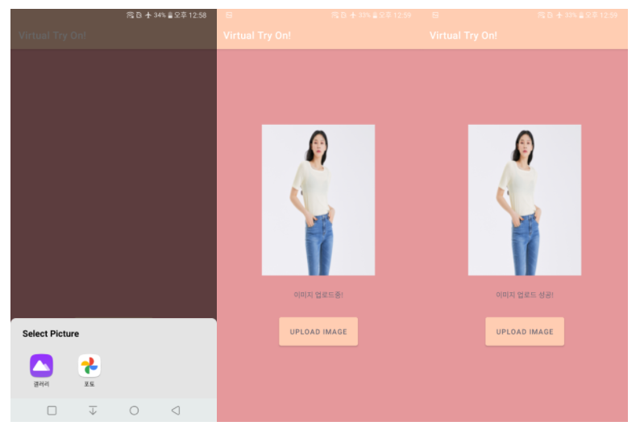
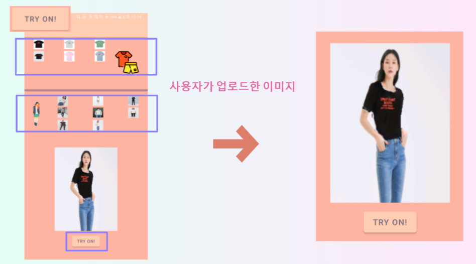

# Virtual Try On

1. [프로젝트 설명](#프로젝트_설명)
2. [실행 환경](#개발_환경)
3. [Demo](#Demo) 
4. [License](#License)
5. [References](#References)
-----------------------

### 프로젝트_설명
> 인공지능 기술을 활용한 가상 피팅 애플리케이션

### 개발_환경

>  #### 서버
>    * Python 3.7.10
>    * Flask 1.1.2
>    * opencv 4.1.2
>    * pytorch 1.8.1

>   #### Android
>

### Demo

#### 메인 화면

#### 옷 버튼 -> UPLOAD IMAGE 

### 전신 사진 버튼 -> UPLOAD IMAGE

### Try On 버튼 -> Try On

### License
The use of this software is RESTRICTED to non-commercial research and educational purposes.

### References

> #### Try On
> ACGPN : [Towards Photo-Realistic Virtual Try-On by Adaptively Generating↔Preserving Image Content](https://arxiv.org/abs/2003.05863), Han Yang, Ruimao Zhang, Xiaobao Guo, Wei Liu, Wangmeng Zuo, Ping Luo, 2020 CVPR ,[(code)](https://github.com/switchablenorms/DeepFashion_Try_On)

> #### Pose estimation
> OpenPose : [https://github.com/CMU-Perceptual-Computing-Lab/openpose](https://github.com/CMU-Perceptual-Computing-Lab/openpose), [Pytorch_version](https://github.com/prasunroy/openpose-pytorch)

> #### Human Segmentation
> [Self-Correction for Human Parsing](https://arxiv.org/abs/1910.09777), Li, Peike and Xu, Yunqiu and Wei, Yunchao and Yang, Yi, 2020 IEEE, [(code)](https://github.com/levindabhi/Self-Correction-Human-Parsing-for-ACGPN)

> #### Clothes Mask
> [https://github.com/sun-pyo/Unet](https://github.com/sun-pyo/Unet)